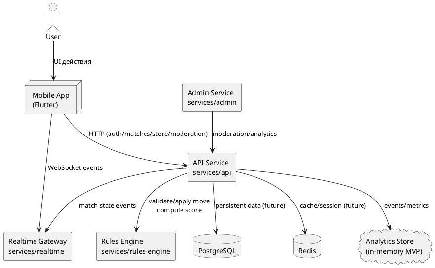

# Архитектура MVP

## Назначение
Документ фиксирует целевую архитектуру монорепозитория TabletopPlatform, связи между сервисами и зоны ответственности модулей.

## Контекст
- Клиент: Flutter-приложение (`apps/mobile`).
- Backend: API, Realtime, Rules Engine, Admin (`services/*`).
- Infra: PostgreSQL + Redis + Docker Compose (`infra`).

## UML-диаграмма архитектуры (PlantUML)

## Текущий поток данных
1. Пользователь взаимодействует с Flutter UI.
2. Клиент отправляет REST-запросы в API и realtime-события в gateway.
3. API валидирует доменные операции и делегирует игровые правила в Rules Engine.
4. API публикует state-обновления в Realtime.
5. Модерация/аналитика доступны через admin-контур.

## Найденные проблемы и исправления в коде
1. Матч можно было создавать для несуществующего пользователя.
2. Активные санкции `ban/mute` могли дублироваться.
3. `unban` снимал только одну активную санкцию, а не все.
4. Store-операции не проверяли существование пользователя и бан.
5. Ход мог отправляться пользователем вне списка игроков матча.

## Предложения по улучшению архитектуры
1. **Вынести авторизацию в middleware**
   - Сейчас часть ограничений (например, бан) проверяется в доменной логике вручную.
   - Рекомендуется единый middleware с проверкой JWT/role/ban.

2. **Перейти от in-memory к репозиториям**
   - Ввести слой `repositories` для пользователей, матчей, санкций, аналитики.
   - Упростит миграцию на PostgreSQL/Redis без изменения бизнес-логики.

3. **Разделить API и admin-boundary по BFF-паттерну**
   - Сейчас админский контур частично смешан с API endpoint-ами.
   - Рекомендуется отдельный admin BFF + аудит/политики в отдельном модуле.

4. **Событийная шина доменных событий**
   - Выделить `domain events` (match_created, move_applied, sanction_applied).
   - Реaltime и аналитика должны подписываться на события, а не вызываться напрямую.

5. **Усилить наблюдаемость (observability)**
   - Добавить structured logging, trace-id, метрики latencies/error rates.
   - В MVP можно начать с единого telemetry-адаптера.
