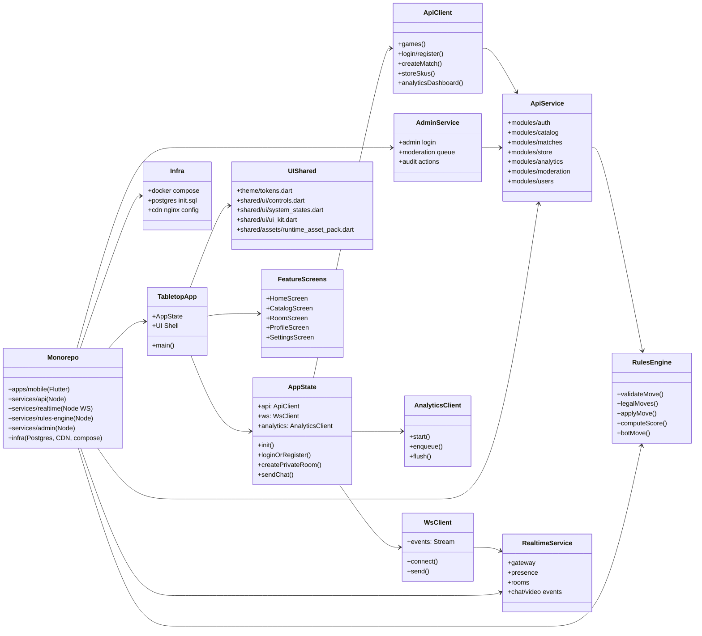

# Назначение: UML-диаграмма текущей архитектуры (ориентир по ветке main).

> Диаграмма отражает актуальную структуру monorepo: mobile app, backend-сервисы, infra и общие docs/scripts.

```mermaid
classDiagram
    direction LR

    class Monorepo {
      +apps/mobile (Flutter)
      +services/api (Node)
      +services/realtime (Node WS)
      +services/rules-engine (Node)
      +services/admin (Node)
      +infra (Postgres, CDN, compose)
    }

    class TabletopApp {
      +main()
      +AppState
      +UI Shell
    }

    class AppState {
      +api: ApiClient
      +ws: WsClient
      +analytics: AnalyticsClient
      +init()
      +loginOrRegister()
      +createPrivateRoom()
      +sendChat()
    }

    class ApiClient {
      +games()
      +login/register()
      +createMatch()
      +storeSkus()
      +analyticsDashboard()
    }

    class WsClient {
      +connect()
      +events: Stream
      +send()
    }

    class AnalyticsClient {
      +start()
      +enqueue()
      +flush()
    }

    class UIShared {
      +theme/tokens.dart
      +shared/ui/controls.dart
      +shared/ui/system_states.dart
      +shared/ui/ui_kit.dart
      +shared/assets/runtime_asset_pack.dart
    }

    class FeatureScreens {
      +HomeScreen
      +CatalogScreen
      +RoomScreen
      +ProfileScreen
      +SettingsScreen
    }

    class ApiService {
      +modules/auth
      +modules/catalog
      +modules/matches
      +modules/store
      +modules/analytics
      +modules/moderation
      +modules/users
    }

    class RealtimeService {
      +gateway
      +presence
      +rooms
      +chat/video events
    }

    class RulesEngine {
      +validateMove()
      +legalMoves()
      +applyMove()
      +computeScore()
      +botMove()
    }

    class AdminService {
      +admin login
      +moderation queue
      +audit actions
    }

    class Infra {
      +docker compose
      +postgres init.sql
      +cdn nginx config
    }

    Monorepo --> TabletopApp
    TabletopApp --> AppState
    TabletopApp --> UIShared
    TabletopApp --> FeatureScreens

    AppState --> ApiClient
    AppState --> WsClient
    AppState --> AnalyticsClient

    ApiClient --> ApiService
    WsClient --> RealtimeService
    ApiService --> RulesEngine
    AdminService --> ApiService

    Monorepo --> ApiService
    Monorepo --> RealtimeService
    Monorepo --> RulesEngine
    Monorepo --> AdminService
    Monorepo --> Infra
```
